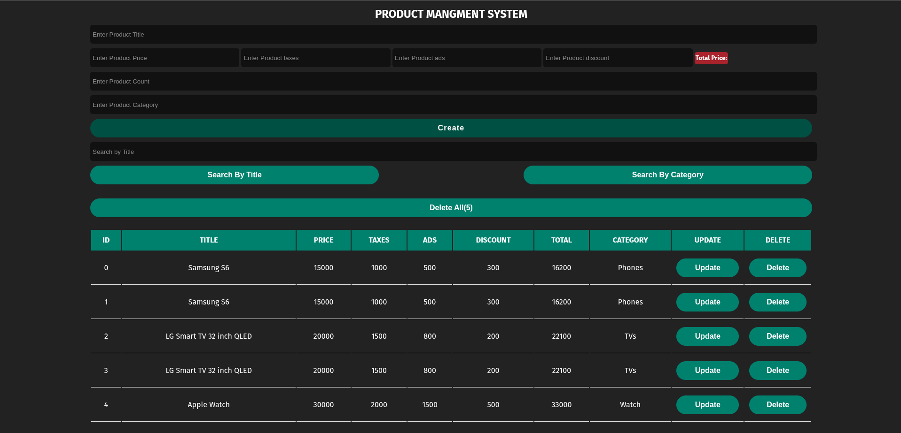

# Product Management System

A simple **Product Management System** built with **HTML, CSS, and JavaScript**.  
This project allows you to **create, read, update, and delete products**, with **automatic total price calculation**, and search functionality.

---

## Features

- Add products with:
  - Title
  - Price
  - Taxes
  - Ads
  - Discount
  - Count
  - Category
- Automatic **Total Price** calculation
- Update and Delete products
- Delete all products at once
- Search by **Title** or **Category**
- Responsive and modern UI

---

## Screenshot



---

## How to Run

1. Clone the repository:

```bash
git clone git@github.com:ahmdamir/Products-Mangment.git
```

2. Open `index.html` in your browser.

---

## Tech Stack

- HTML
- CSS
- JavaScript
